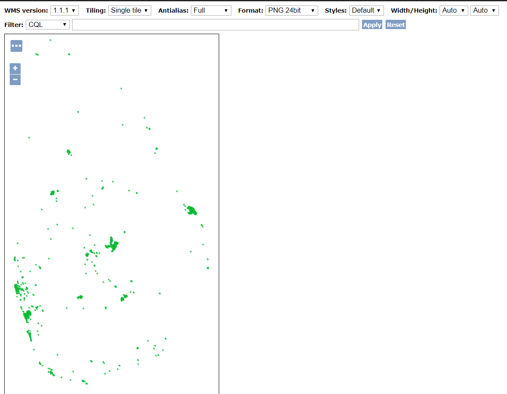
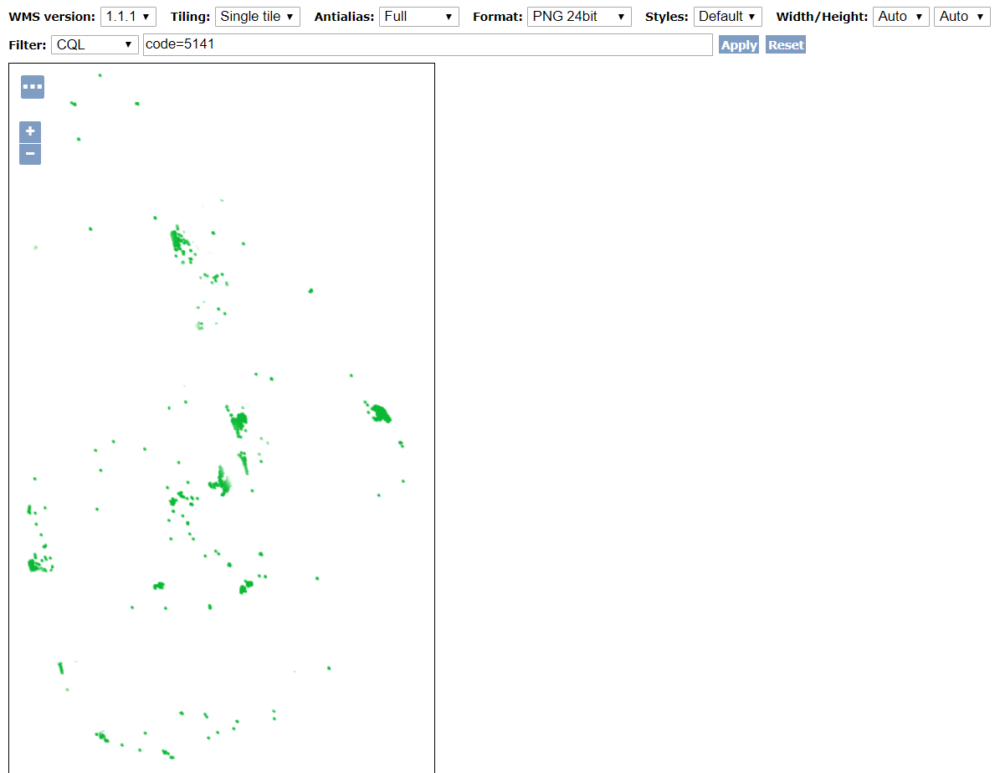
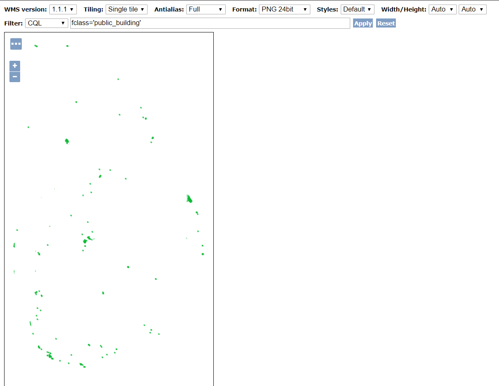

# Using Common Query Language (CQL) in WMS Layer

Select `three dot`on the Openlayer Layer Preview
    

And then using the value of `code=5141`.
    

    
Then Finally using the value of `fclass='public_building`.
    

    
    
