# Web map that displays a WMS layer

(1) Install Geoserver from http://geoserver.org/release/stable.

(2) Then open http://localhost:8080/geoserver/web/ and login with your username and password, given while you’re installing the Geoserver process in Point 1. The default username is `admin` and the password is `geoserver`.

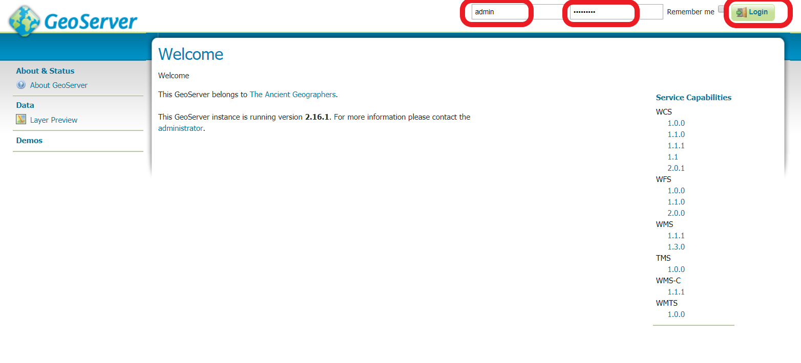

(3) On your Left, `Select Data` → `Workspaces`. 

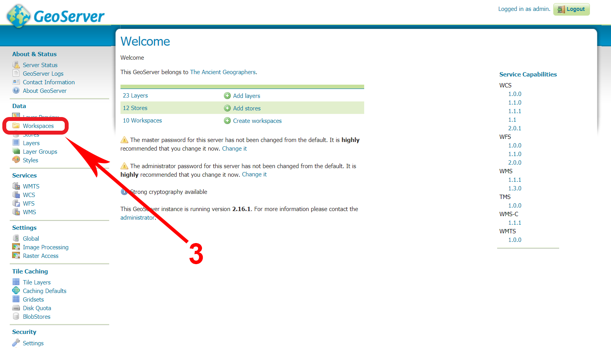

(4) Select `Add new workspace`.

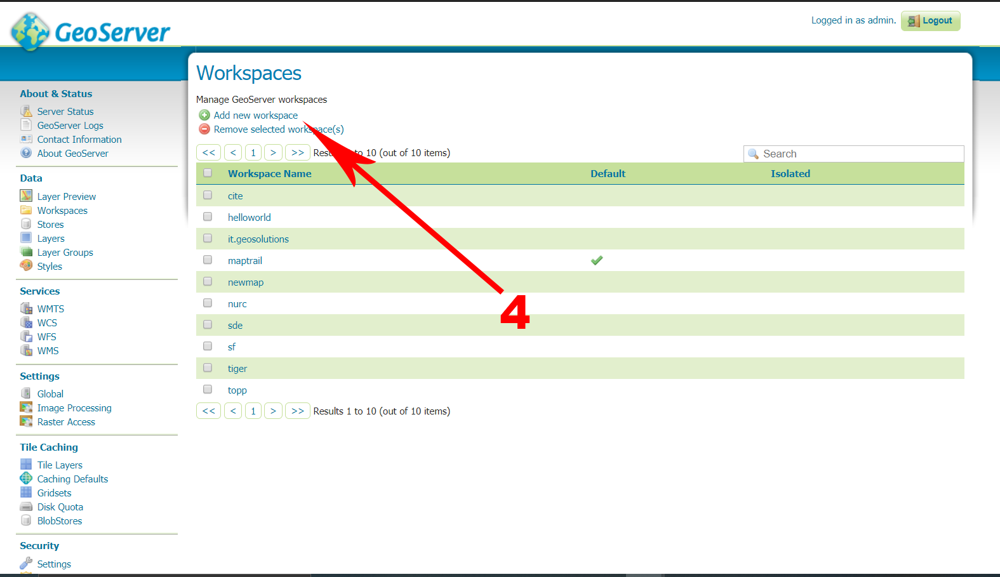

(5) Give a `name`.

(6) Then for Namespace URI give as `http://geoserver.org/name/`

(7) Then `submit` it.

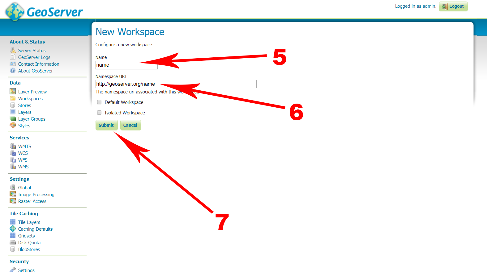

(8) Now, Your Workspace is created.

(9) Then Go to `Data` → `Stores`.

(10) Then click `Add new store`.

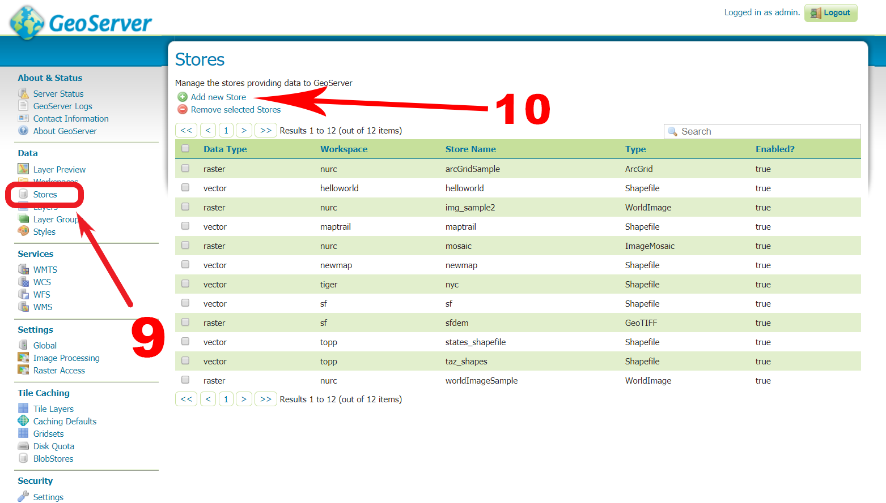

(11) Select the Vector Data `Souces` → `shapefile`.

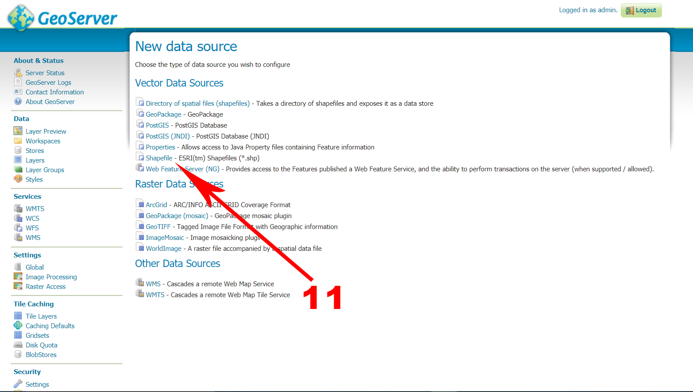

(12) Then select your Workspace `name` created in Point 6.

(13) Give a `Data Source Name`.

(14) `Browse` and locate the `Shapefile`.

(15) `Submit` it.

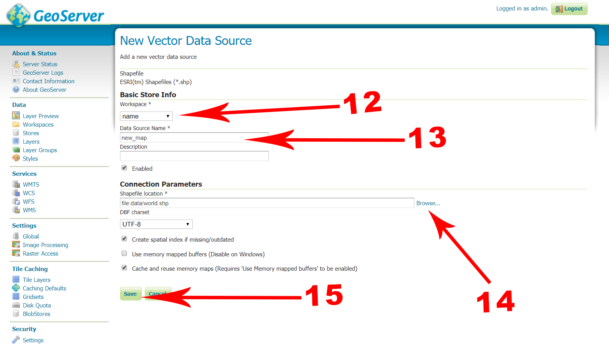

(16) Click on `Publish`.

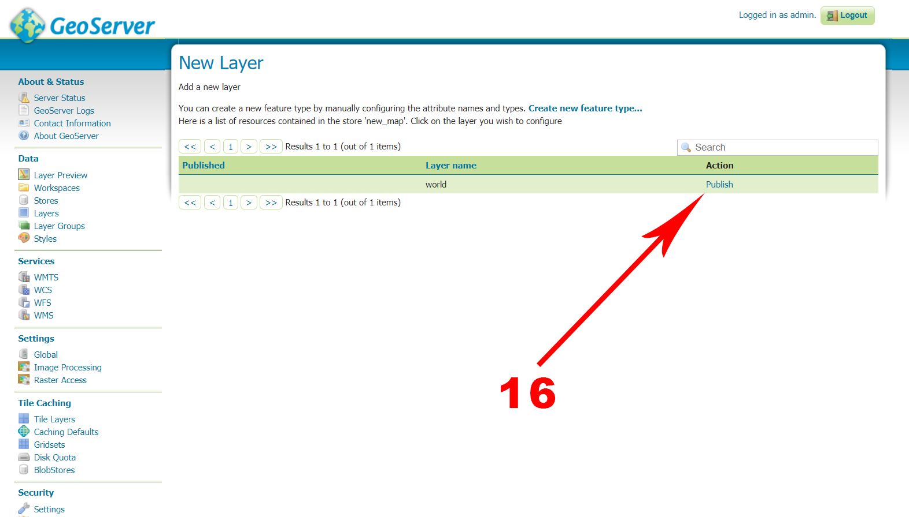

(17) Scroll Down, and find Bounding Boxes, then click on `compute from data`.

(18) Then again click on `Compute on native bounds`.

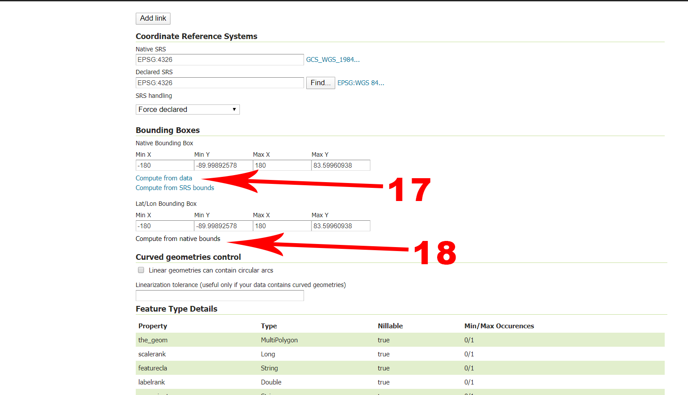

(19) Then `save` it.

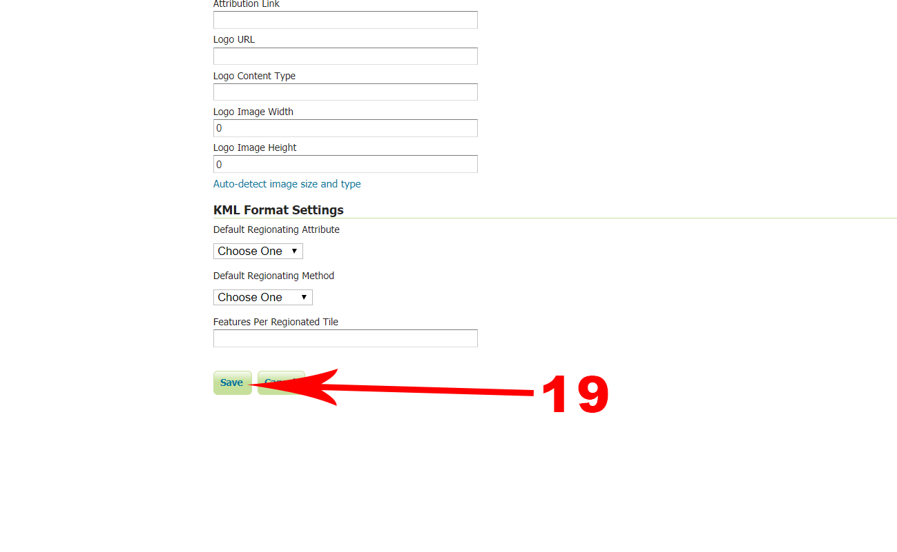

(20) Now, Go to `Data` → `Layer Preview`.

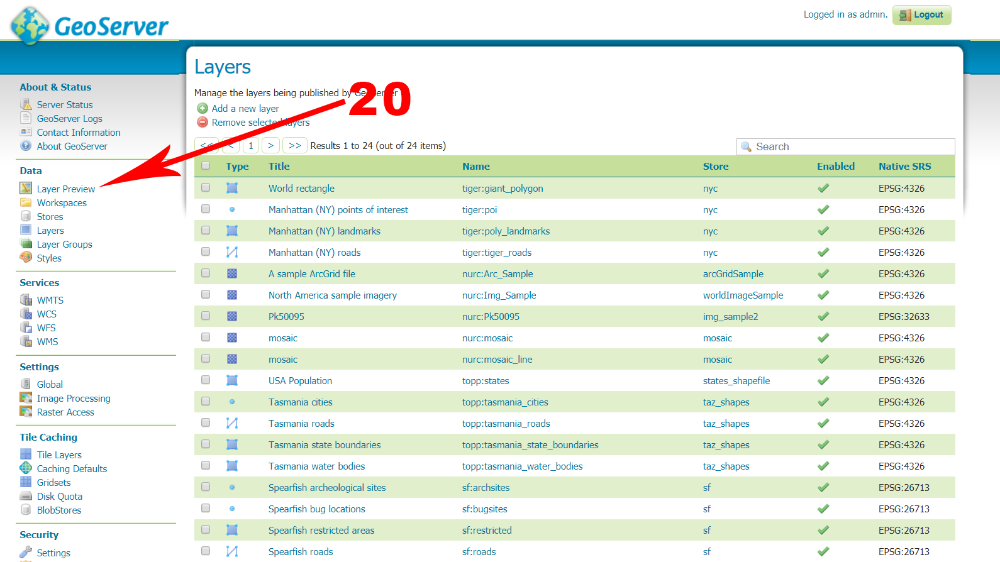

(21) Search your Created Layer and select the Openlayer.

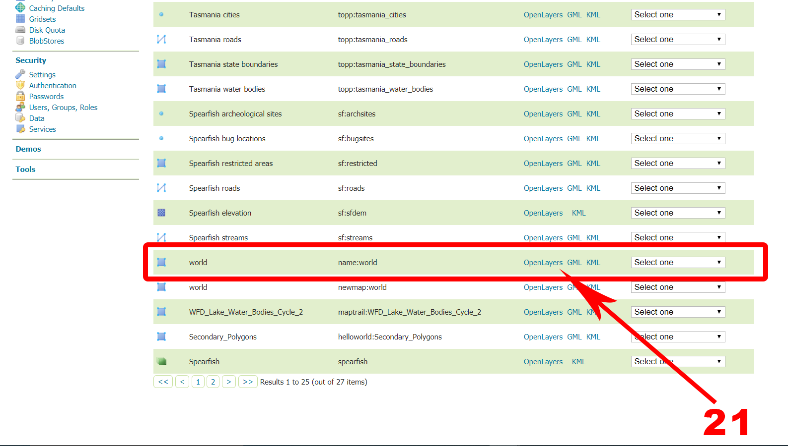

(22) A pop-up tab opens and shows the Layer.

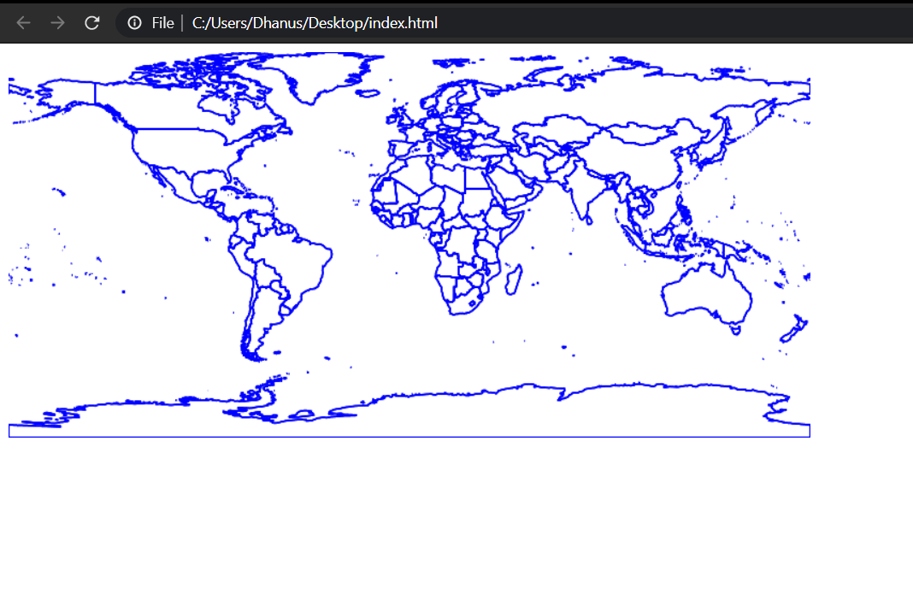

### CONTINUE WITH CQL - https://github.com/Dhanus3133/WMS-Layer/tree/master/CQL
